






-  I am an HCI+Health researcher at Tsinghua University🎓. I am now a member of [Pervasive HCI Group](https://pi.cs.tsinghua.edu.cn/), advised by [Prof. Yuanchun Shi](https://scholar.google.com/citations?user=TZm3-pwAAAAJ&hl=zh-CN), [A/Prof. Yuntao Wang](https://scholar.google.com/citations?user=kHpwoAUAAAAJ&hl=zh-CN), and [Prof. Yingqing Xu](https://scholar.google.com/citations?hl=zh-CN&user=zSiDAt4AAAAJ). I have done research in the [Department of Computer Science and Technology](https://www.cs.tsinghua.edu.cn/csen/), [Global Innovation Exchange](https://gix.uw.edu/), [Future Lab](https://thfl.tsinghua.edu.cn/en/), and [School of Vehicle and Mobility](http://www.svm.tsinghua.edu.cn/). I was a researcher at Tsinghua-Toyota AI Center and an intern at ANT Group. I enjoy working with academia and industry.

- 🔭 My research interests include `Remote Physiological Sensing`, `Pervasive Computing`, `Human-Computer Interaction (HCI)`.
 
- 📫 Reach me through `tjk24 at mails.tsinghua.edu.cn` if interested.  

<!--  GitHub_List = ['https://github.com/thuhci/ANT_PPG','https://github.com/Arktis2022/Spiking-PhysFormer','https://github.com/THUDM/LongBench','https://github.com/thuhci/SUMS','https://github.com/McJackTang/LLM-HealthAssistant','https://github.com/Health-HCI-Group/Largest_rPPG_Dataset_Evaluation','https://github.com/ubicomplab/rPPG-Toolbox','https://github.com/KegangWangCCNU/RLAP-dataset','https://github.com/McJackTang/MMPD_rPPG_dataset','https://github.com/THU-CS-PI-LAB/ANFC-Automated-Nailfold-Capillary']  -->

<!--    -->

  
中文简介

  唐健凯，清华大学学生辅导员，北京市学生研究员。唐健凯围绕普适健康计算，研究智能手机和可穿戴设备的端智能健康计算，解决跨环境、跨人群的泛化能力差和运动噪声大等难题。通过建模人体可见光下心血管颜色时序变化，提出基于RGB摄像头的视频生理感知计算方法，优化端侧算法高效推理架构，创新低功耗、高性能、强泛化的端智能感知计算技术，服务健康医疗等高影响力应用领域。唐健凯作为负责人曾主持国家级大创项目一项，北京市自然科学基金项目一项并获评优秀（Top 5），参与国家级及省部级项目近10项。曾在SCI期刊或CCF-A会议等有影响力期刊/会议发表论文30+篇，包括Science Advances、NeurIPS、ACL、IMWUT、CHI、Neural Networks等，其中第一作者（含共一）10篇,谷歌学术引用1500+次。唐健凯提出的基于视频的远程心率监测方法性能接近医疗级设备，荣获UbiComp Openwearable最佳论文奖、首届全国泛在智能感知技术创新应用大赛一等奖和第九届全国大学生生物医学工程创新设计竞赛一等奖。
<!--   教育背景：清华大学新雅书院本科（专业：智能工程与创意设计），工学学士，艺术学学士，清华大学计算机系研究生。 -->

# 🔥 News
**2025.12:** 🎉🎉 Our paper **One-stop Strabismus Digital Diagnosis via AI-integrated Skin-like and Wearable "Eyelectronics'** has been accepted by **Science Advances**

**2025.12:** 🎉🎉 [FacePhys](https://facephys.com) got reported by official media of [Tsinghua University (清华大学)](https://mp.weixin.qq.com/s/hml_B_KuFxiaWiE6vHSoGA)

**2025.11:** 🎉🎉 [FacePhys](https://facephys.com) won the **First Prize**  in Tsinghua MedTech Competition.

**2025.10:** 🎉🎉 Our paper regarding the smart ring platform won the **Best Paper Award**  [τ-Ring](https://arxiv.org/abs/2508.00778) in OpenWearable Workshop of [UbiComp'25](https://www.ubicomp.org/ubicomp-iswc-2025/).

**2025.8:** 🎉🎉 Three papers ([Ring-Survey](https://arxiv.org/pdf/2502.02459), [τ-Ring](https://arxiv.org/abs/2508.00778), [Cardiorespiratory Coupling](https://arxiv.org/abs/2508.00773)) have been accepted by [IMWUT](https://dl.acm.org/journal/imwut)/[UbiComp'25](https://www.ubicomp.org/ubicomp-iswc-2025/).

**2025.5:** Our [FacePhys](https://facephys.com) Project got reported by official media, including: [Tsinghua University (清华大学)](https://mp.weixin.qq.com/s/LPts1lfIW121wQABaEmxnA), [MGTV（芒果TV/湖南新闻联播)](https://www.mgtv.com/b/714997/22870059.html?t=videoshare&externalsource=v_play&tc=jXKKosRPSAN7&f=wxf&dc=501ef234-cc31-4165-9991-6d0457ce8ce8), [VOC（湖南日报）](https://m.voc.com.cn/xhn/news/202505/29399852.html)

**2025.2:** Awarded the **Excellent Beijing Natural Science Foundation Program** by Beijing Natural Science Foundation as Principle Investigator.

**2025.1:** Our paper [Spiking-PhysFormer: Camera-BasedRemote Photoplethysmography withParallel Spike-driven Transformer](https://arxiv.org/abs/2402.04798) has been accepted by [Neural Networks](https://www.sciencedirect.com/journal/neural-networks)(Q1, IF:6.0).

**2024.11:** Awarded the **Excellent Graduation Thesis** by Beijing Municipal Education Commission.

**2024.11:** Awarded the **First Prize** in Ubiquitous Intelligent Sensing Technology Innovation Application Competition(Top 5).

**2024.10:** 🎉🎉 Our paper [Summit Vitals: Multi-Camera and Multi-Signal Biosensing at High Altitudes](https://arxiv.org/abs/2409.19223) has been accepted by [UIC'24](https://www.ieee-smart-world.org/2024/uic/) as REGULAR RESEARCH PAPER(Accept Rate: 20.95%).

**2024.9:** 🎉🎉 Attended the [The Inclusion·Conference on the Bund](https://www.inclusionconf.com/) and publish our white paper and [ANT PPG](https://github.com/thuhci/ANT_PPG) dataset.

**2024.7:** 🎉🎉 Awarded the **First Prize** in the National Biomedical Engineering Innovation Competition(Top 5%). 

**2024.6:** 🎉🎉 Give an invited talk at the Commencement Ceremony of Xinya College and awarded **Outstanding Graduate** and **Excellent Graduation Thesis** by Tsinghua University.

**2024.5:** 🎉🎉 Our paper [The EarSAVAS Dataset: Enabling Subject-Aware Vocal Activity Sensing on Earables](https://dl.acm.org/doi/10.1145/3659616) has been accepted by [The Proceedings of the ACM on Interactive, Mobile, Wearable and Ubiquitous Technologies (IMWUT)](https://dl.acm.org/journal/imwut).

**2024.5:** 🎉🎉 Our paper [LongBench: A Bilingual, Multitask Benchmark for Long Context Understanding](https://github.com/THUDM/LongBench)  has been accepted by [ACL 2024](https://2024.aclweb.org/).

**2024.5:** 🎉🎉 Attending [CHI Workshop 2024 PhysioCHI](https://chi2024.acm.org/for-authors/workshops/accepted-workshops/) and present our work [Camera-Based Remote Physiology Sensing for Hundreds of Subjects Across Skin Tones](https://arxiv.org/abs/2404.05003).

**2024.4:** 🎉🎉 Admitted into the Groundbreaking Innovation Talent Development Program(颠覆性创新人才培养项目) at Tsinghua University.

**2024.2:** 🎉🎉 Our paper [A Comprehensive Dataset and Automated Pipeline for Nailfold Capillary Analysis](https://doi.org/10.48550/arXiv.2312.05930) has been accepted by [ISBI 2024](https://biomedicalimaging.org/2024/).

# 📝 Publications 
#### JOURNAL PUBLICATIONS

  

NN

<!-- --------------------------------------------------------------------------------------------------------------- -->

## [Spiking-PhysFormer: Camera-Based Remote Photoplethysmography with Parallel Spike-driven Transformer ](https://github.com/Arktis2022/Spiking-PhysFormer)

Mingxuan Liu\*, **Jiankai Tang\*** (\*Co-first Author), Haoxiang Li, Jiahao Qi, Siwei Li, Kegang Wang, Yuntao Wang, Hong Chen

[Neural Networks](https://www.sciencedirect.com/journal/neural-networks)

    <a class="_blank" href="https://arxiv.org/abs/2402.04798" >
        <i class="fas fa-newspaper" aria-hidden="true"></i> Paper
    </a>
  <a class="_blank" href="https://github.com/Arktis2022/Spiking-PhysFormer">
        <i class="ai ai-open-access ai-1x" aria-hidden="true"></i> Code
    </a>

JCAD
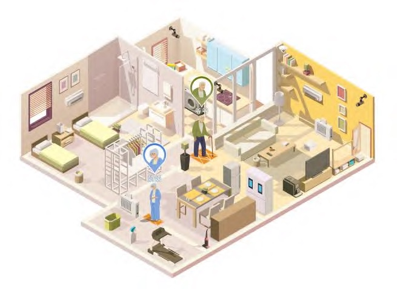

<!-- --------------------------------------------------------------------------------------------------------------- -->
  
## A Method of Privacy-Friendly Gait Data Acquisition and Emotion Recognition

Hong Xiao, **Jiankai Tang**, Christine Qiu, Xinyi Fu

[JCAD](https://www.jcad.cn/)

    <a class="_blank" href="https://kns.cnki.net/kcms2/article/abstract?v=ebrKgZyeBkxJAkKmLRGB8ZBzoL0_JE1z5CJDrfO0vn9sAN5P7cZCI7TMzal9BZkSQQ-tNRL5sj5jZJV8Erzh5u0t4amz6h_o_KdkPSubDPVnvkfMkClSYlPa5iaNSWFktEGmXFOfGWIXzhFL20NQyw==&uniplatform=NZKPT&language=CHS" >
        <i class="fas fa-newspaper" aria-hidden="true"></i> Paper
    </a>

<!-- --------------------------------------------------------------------------------------------------------------- -->

IMWUT
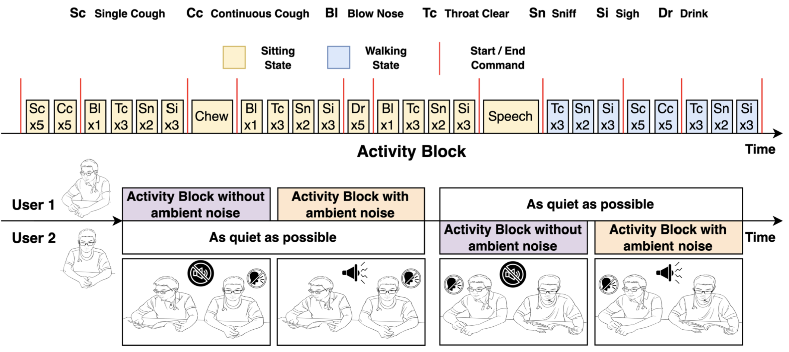

  
## [The EarSAVAS Dataset: Enabling Subject-Aware Vocal Activity Sensing on Earables ](https://github.com/thuhci/EarSAVAS)

Xiyuxing Zhang, Yuntao Wang, Yuxuan Han, Chen Liang, Ishan Chatterjee, **Jiankai Tang**, Xin Yi, Shwetak Patel, and Yuanchun Shi

[IMWUT](https://dl.acm.org/journal/imwut)

    <a class="_blank" href="https://dl.acm.org/doi/10.1145/3659616" >
        <i class="fas fa-newspaper" aria-hidden="true"></i> Paper
    </a>
  <a class="_blank" href="https://github.com/thuhci/EarSAVAS">
        <i class="ai ai-open-access ai-1x" aria-hidden="true"></i> Code
    </a>

IMWUT
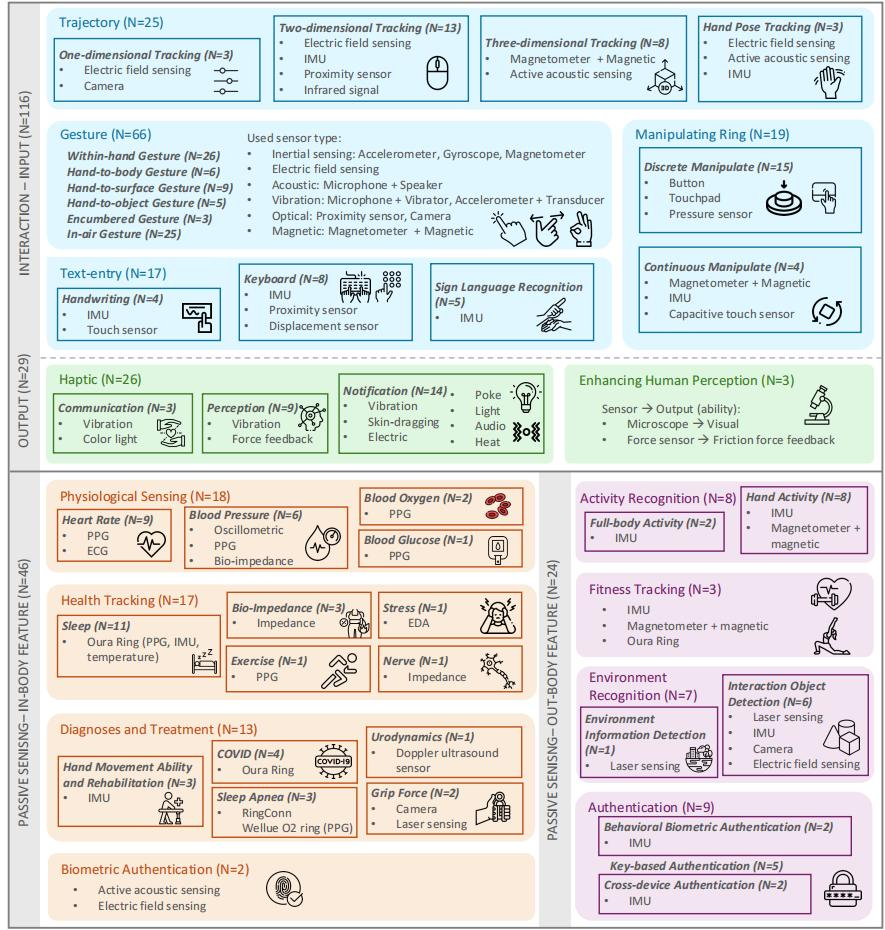

## [Computing with Smart Rings: A Systematic Literature Review]

Zeyu Wang, Ruotong Yu, Xiangyang Wang, Jiexin Ding, **Jiankai Tang**, Jun Fang, Zhe He, Zhuojun Li, Tobias Röddiger, Weiye Xu, Xiyuxing Zhang, Nan Gao, Chun Yu, Yuanchun Shi, Yuntao Wang

[IMWUT](https://dl.acm.org/journal/imwut)

    <a class="_blank" href="https://arxiv.org/pdf/2502.02459" >
        <i class="fas fa-newspaper" aria-hidden="true"></i> Paper
    </a>

#### CONFERENCE PUBLICATIONS
<!-- --------------------------------------------------------------------------------------------------------------- -->

UbiComp 2025
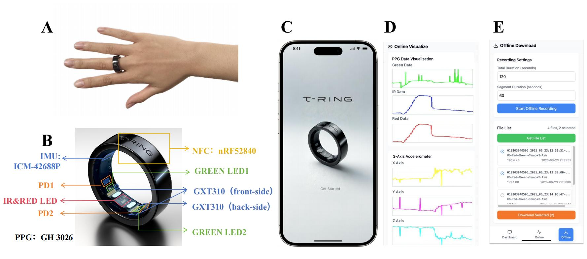

## [τ-Ring: A Smart Ring Platform for Multimodal Physiological and Behavioral Sensing 🏆 (Best Paper Award)](https://github.com/thuhci/OpenRing)

**Jiankai Tang***, Zhe He*, Mingyu Zhang, Wei Geng, Chengchi Zhou, Weinan Shi, Yuanchun Shi, Yuntao Wang

[UbiComp' 2025 Workshop](https://www.ubicomp.org/ubicomp-iswc-2025). 

    <a class="_blank" href="https://arxiv.org/abs/2508.00778" >
        <i class="fas fa-newspaper" aria-hidden="true"></i> Paper
    </a>
      <a class="_blank" href="https://github.com/thuhci/OpenRing">
        <i class="ai ai-open-access ai-1x" aria-hidden="true"></i> Code
    </a>

<!-- --------------------------------------------------------------------------------------------------------------- -->

<!-- --------------------------------------------------------------------------------------------------------------- -->

UbiComp 2025
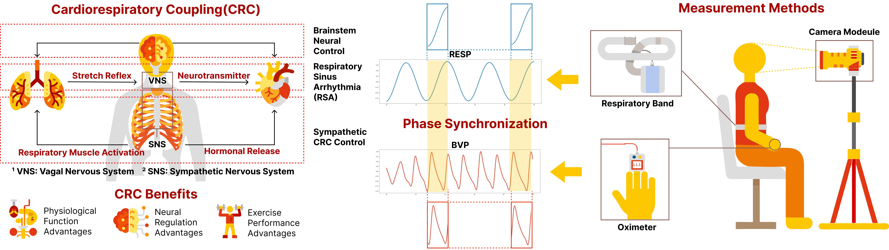

## [Contact Sensors to Remote Cameras: Quantifying Cardiorespiratory Coupling in High-Altitude Exercise Recovery ](https://github.com/McJackTang/CRC)

**Jiankai Tang**, Meng Kang, Yiru Zhang, Kegang Wang, Daniel Mcduff, Xin Liu, Yuanchun Shi, Yuntao Wang

[UbiComp' 2025 Workshop](https://www.ubicomp.org/ubicomp-iswc-2025). 

    <a class="_blank" href="https://arxiv.org/abs/2508.00773" >
        <i class="fas fa-newspaper" aria-hidden="true"></i> Paper
    </a>
      <a class="_blank" href="https://github.com/McJackTang/CRC">
        <i class="ai ai-open-access ai-1x" aria-hidden="true"></i> Code
    </a>

<!-- --------------------------------------------------------------------------------------------------------------- -->

MICCAI 2025
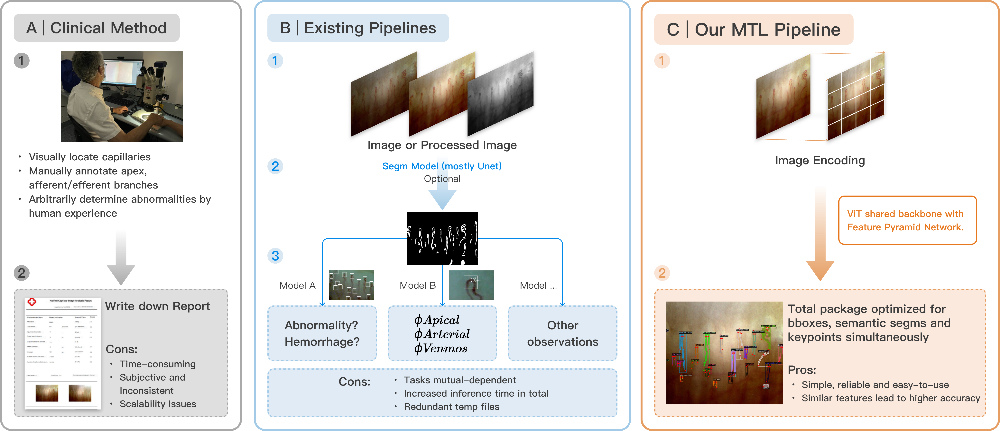

<!-- --------------------------------------------------------------------------------------------------------------- -->
  
## [NFCMTL: Auto NailFold Capillaroscopy through a Multi-Task Learning Model 🏆 (Runner Up Best Paper Award) ](https://github.com/thuhci/NFCMTL)

Yingke Ding, **Jiankai Tang**, Wanying Mo, Tianruo Rose Xu, Yuanchun Shi, Yuntao Wang

[MICCAI'25 Workshop](https://conferences.miccai.org/2025/). 

    <a class="_blank" href="https://openreview.net/pdf?id=u0m4T1aUo1" >
        <i class="fas fa-newspaper" aria-hidden="true"></i> Paper
    </a>
      <a class="_blank" href="https://github.com/thuhci/NFCMTL">
        <i class="ai ai-open-access ai-1x" aria-hidden="true"></i> Code
    </a>

<!-- --------------------------------------------------------------------------------------------------------------- -->

<!-- --------------------------------------------------------------------------------------------------------------- -->

UIC 2024
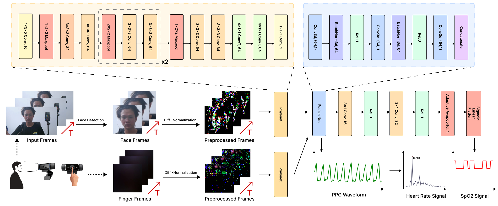

## [Summit Vitals: Multi-Camera and Multi-Signal Biosensing at High Altitudes ](https://github.com/thuhci/SUMS)

Ke Liu*, **Jiankai Tang\*** (\*Co-first Author), Zhang Jiang, Yuntao Wang, Xiaojing Liu, Dong Li, Yuanchun Shi

[UIC'24](https://www.ieee-smart-world.org/2024/uic/). 

    <a class="_blank" href="https://arxiv.org/abs/2409.19223" >
        <i class="fas fa-newspaper" aria-hidden="true"></i> Paper
    </a>
      <a class="_blank" href="https://github.com/thuhci/SMUS">
        <i class="ai ai-open-access ai-1x" aria-hidden="true"></i> Code
    </a>

<!-- --------------------------------------------------------------------------------------------------------------- -->

<!-- --------------------------------------------------------------------------------------------------------------- -->

UIC 2024
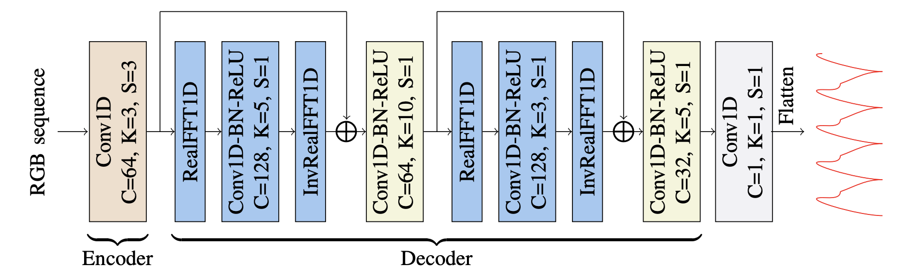

## [Camera-Based HRV Prediction for Remote Learning Environments ](https://github.com/KegangWangCCNU/RLAP-dataset)

Kegang Wang, Yantao Wei, **Jiankai Tang**, Yuntao Wang, Mingwen Tong, Jie Gao, Yujian Ma, Zhongjin Zhao

[UIC'24](https://www.ieee-smart-world.org/2024/uic/). 

    <a class="_blank" href="https://arxiv.org/pdf/2305.04161" >
        <i class="fas fa-newspaper" aria-hidden="true"></i> Paper
    </a>
      <a class="_blank" href="https://github.com/KegangWangCCNU/RLAP-dataset">
        <i class="ai ai-open-access ai-1x" aria-hidden="true"></i> Code
    </a>

<!-- --------------------------------------------------------------------------------------------------------------- -->

<!-- --------------------------------------------------------------------------------------------------------------- -->

CHI 2024
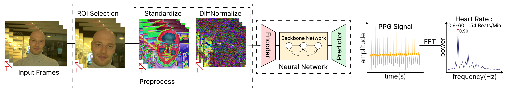

## [Camera-Based Remote Physiology Sensing for Hundreds of Subjects Across Skin Tones ](https://github.com/Health-HCI-Group/Largest_rPPG_Dataset_Evaluation)

**Jiankai Tang\***, Xinyi Li\*(\*Co-first Author), Jiacheng Liu, Xiyuxing Zhang, Zeyu Wang, Yuntao Wang

[CHI Workshop PhysioCHI 2024](https://chi2024.acm.org/for-authors/workshops/accepted-workshops/). 

    <a class="_blank" href="https://arxiv.org/abs/2404.05003" >
        <i class="fas fa-newspaper" aria-hidden="true"></i> Paper
    </a>
      <a class="_blank" href="https://github.com/Health-HCI-Group/Largest_rPPG_Dataset_Evaluation">
        <i class="ai ai-open-access ai-1x" aria-hidden="true"></i> Code
    </a>

<!-- --------------------------------------------------------------------------------------------------------------- -->

ISBI 2024
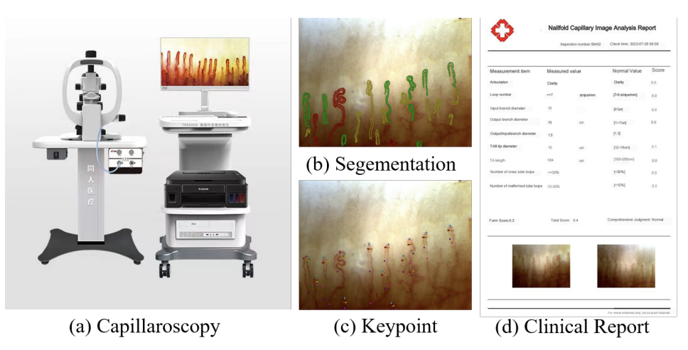

## [A Comprehensive Dataset and Automated Pipeline for Nailfold Capillary Analysis ](https://github.com/THU-CS-PI-LAB/ANFC-Automated-Nailfold-Capillary)

Linxi Zhao, **Jiankai Tang**, Dongyu Chen, Xiaohong Liu, Yong Zhou, Guangyu Wang, Yuntao Wang

[ISBI 2024](https://biomedicalimaging.org/2024/). 

    <a class="_blank" href="arxiv.org/abs/2312.05930" >
        <i class="fas fa-newspaper" aria-hidden="true"></i> Paper
    </a>
      <a class="_blank" href="https://github.com/THU-CS-PI-LAB/ANFC-Automated-Nailfold-Capillary">
        <i class="ai ai-open-access ai-1x" aria-hidden="true"></i> Code
    </a>

ACL 24
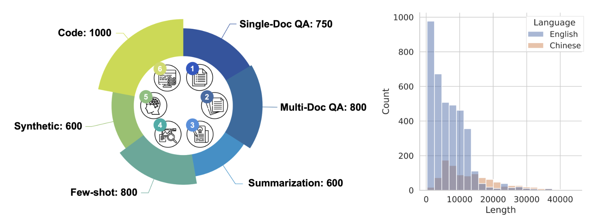

## [LongBench: A Bilingual, Multitask Benchmark for Long Context Understanding ](https://github.com/THUDM/LongBench)

Yushi Bai, Xin Lv, Jiajie Zhang, Hongchang Lyu, **Jiankai Tang**, Zhidian Huang, Zhengxiao Du, Xiao Liu, Aohan Zeng, Lei Hou, Yuxiao Dong, Jie Tang, Juanzi Li

ACL 24

    <a class="_blank" href="https://arxiv.org/abs/2308.14508" >
        <i class="fas fa-newspaper" aria-hidden="true"></i> Paper
    </a>
      <a class="_blank" href="https://github.com/THUDM/LongBench">
        <i class="ai ai-open-access ai-1x" aria-hidden="true"></i> Code
    </a>

AI Health Summit 2023
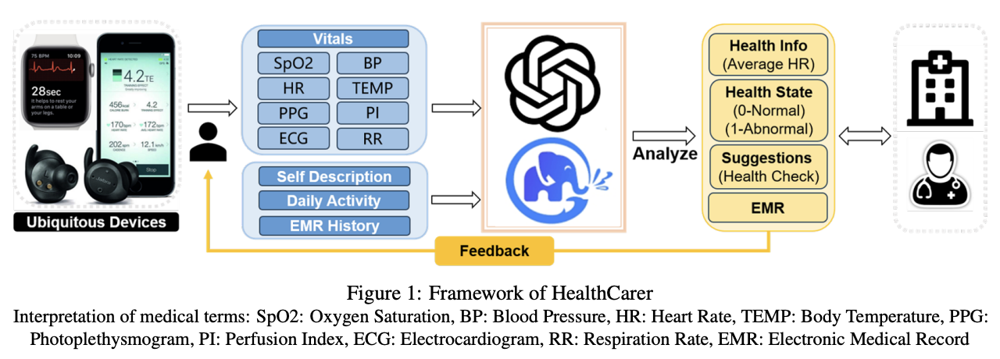

## [ALPHA: AnomaLous Physiological Health Assessment Using Large Language Models ](https://github.com/McJackTang/LLM-HealthAssistant)

**Jiankai Tang**, Kegang Wang, Hongming Hu, Xiyuxing Zhang, Peiyu Wang, Xin Liu, Yuntao Wang

[AI Health Summit 2023](https://healthsummit.ai/main/abstracts/). 

    <a class="_blank" href="https://arxiv.org/abs/2311.12524" >
        <i class="fas fa-newspaper" aria-hidden="true"></i> Paper
    </a>
      <a class="_blank" href="https://github.com/McJackTang/LLM-HealthAssistant">
        <i class="ai ai-open-access ai-1x" aria-hidden="true"></i> Code
    </a>

EMBC 2023
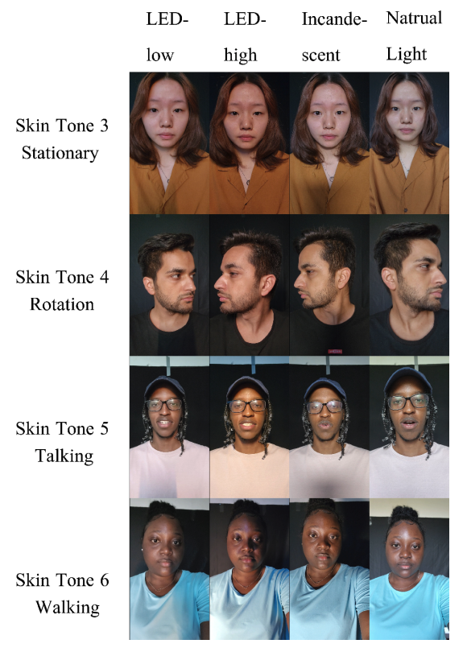

## [MMPD: Multi-Domain Mobile Video Physiology Dataset ](https://github.com/McJackTang/MMPD_rPPG_dataset)

**Jiankai Tang**, Kequan Chen, Yuntao Wang, Yuanchun Shi, Shwetak Patel, Daniel McDuff, Xin Liu

[IEEE EMBC 2023](https://embc.embs.org/2023/) (Oral)

    <a class="_blank" href="https://arxiv.org/abs/2302.03840" >
        <i class="fas fa-newspaper" aria-hidden="true"></i> Paper
    </a>
    <a class="_blank" href="https://github.com/McJackTang/MMPD_rPPG_dataset">
        <i class="ai ai-open-access ai-1x" aria-hidden="true"></i> Code
    </a>

NeurIPS 2023
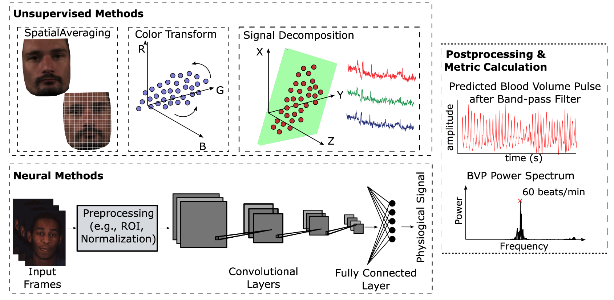

## [rPPG-Toolbox: Deep Remote PPG Toolbox ](https://github.com/ubicomplab/rPPG-Toolbox)

Xin Liu, Girish Narayanswamy, Akshay Paruchuri, Xiaoyu Zhang, **Jiankai Tang**, Yuzhe Zhang, Yuntao Wang, Soumyadip Sengupta, Shwetak Patel, Daniel McDuff

[NeurIPS 2023](https://neurips.cc/)

    <a class="_blank" href="https://arxiv.org/abs/2210.00716" >
        <i class="fas fa-newspaper" aria-hidden="true"></i> Paper
    </a>
    <a class="_blank" href="https://github.com/ubicomplab/rPPG-Toolbox">
        <i class="ai ai-open-access ai-1x" aria-hidden="true"></i> Code
    </a>

# 🎖 Honors and Awards
- *2025* **First Prize**, Tsinghua MedTech Competition.
- *2025* **Best Paper Award**, UbiComp'25 OpenWearable.
- *2025* **Best Paper Award**, MICCAI'25 EMERGE.
- *2025* **Excellent Beijing Natural Science Foundation Program**, Beijing Natural Science Foundation(Principle Investigator, Top 5).
- *2024* **Excellent Graduation Thesis**, Beijing Municipal Education Commission(Top 0.8%).
- *2024* **First Prize** in Ubiquitous Intelligent Sensing Technology Innovation Application Competition(Top 5).
- *2024* **First Prize** in the National Biomedical Engineering Innovation Competition(Top 5%). 
- *2024* **Excellent Graduation Thesis** at Tsinghua University(Top 1 in Department).
- *2024* **Outstanding Graduate** at Tsinghua University（Top 10%）.
- *2024* **Best Presentation Award** at Tsinghua University Initiative Scientific Research Program Forum(Top 5).
- *2023* **National Scholarship, Ministry of Education**, P.R. China (Top 1 in Department)   &nbsp; &nbsp; &nbsp; *Top scholarship in China. 0.2% domestically*.
- *2023* **Scholarship for Social Work Excellence**, Tsinghua University
- *2023* **Scholarship for Science and Technology Innovation Excellence**, Tsinghua University
- *2022* **Scholarship for Social Work Excellence**, Tsinghua University
- *2022* **Scholarship for Science and Technology Innovation Excellence**, Tsinghua University
- *2021* **Scholarship for Social Work Excellence**, Tsinghua University

# 📖 Educations
- *2024.06 - 2027.06*, the Department of Computer Science and Technology, Tsinghua University
  - 2024.09-2026.09, Medical & Engineering Improvement Program, Tsinghua University
- *2019.06 - 2024.06*, Creative Design and Intelligent Engineering(CDIE, 智班), double majors in Automation and Industrial Design, Xinya College, Tsinghua University
  - 2022.7-2023.7, Artificial Intelligence Innovation and Entrepreneurship Program, Tsinghua University
  - 2023.6-2023.9, Access Computing Summer Program, Tsinghua University/University of Washington/GIX
  - 2022.1, Artificial Intelligence and Machine Learning Winter Program, Oxford University
    
<!-- 

  
  
  
  

-->

# 💬 Invited Talks
- *2025.12*, Cardiovascular Digital-Intelligent Health Conference, Beijing Heart Society & Chinese Association of Geriatric Research
- *2024.06*, Commencement Ceremony, Xinya College, Tsinghua University
- *2024.04*, LLM Applications in Social Work, Tsinghua University
- *2023.07*, MMPD Presentation, IEEE Engineering in Medicine and Biology Society
- *2022.12*, Creative Software, Xinya College, Tsinghua University
- *2022.05*, Patent Writing, Xinya College, Tsinghua University

# 💻 Internships
- *2024.01 - 2025.02*, [Ant Group](https://www.antgroup.com/) Pedcha Lab, China.

<!-- 

  
  

-->

# 👨🏻‍🎓 Service and Leadership
- Session Chair: UbiComp'25
- Technical Program Committee: IEEE BSN'25, ICHEC'25
- Conference Reviewers: MobileHCI'24, NIPS'24, MICCAI'25, ACM MM'25, IEEE BSN'25, ICHEC'25
- Journal Reviewers: IMWUT, TIFS, TCE
- 2024-Now: Science and Innovation Mentor, Xinya College, Tsinghua University
- 2023-2025: Chairman of Hunan Culture Association,  Tsinghua University
- 2021-2023: Leader of Creative Design and Intelligent Engineering. CDIE9 was honored with the award of “Excellent Academic Class”.
- 2022-2023: Vice president of the Science and Innovation Association, Xinya College.
  
# 🔗 LINKS
Pervasive HCI Group: [The lab for Pervasive Computing and Human-Computer Interaction at Tsinghua](https://pi.cs.tsinghua.edu.cn/) Yuntao Wang: [Associate Professor, Department of Computer Science and Technology, Tsinghua University](https://pi.cs.tsinghua.edu.cn/lab/people/YuntaoWang/) Xin Liu: [Research Scientist, Google Consumer Health Research and a research affiliate, the Paul G. Allen School of Computer Science & Engineering, University of Washington](https://xliucs.github.io/) Mingxuan Liu: [Department of Biomedical Engineering, Tsinghua University](https://arktis2022.github.io/)

<!-- 
## Hidden Content 
  **2023.12:** 🎉🎉 Awarded **Best Presentation** at Tsinghua University Initiative Scientific Research Program Forum.
  
  **2023.11:** Attended the AI Health Summit 2023 held in Singapore and posted a [poster](https://arxiv.org/abs/2311.12524) about Anomalous Physiological Health Assessment Using Large Language Models.
  
  **2023.11:** 🎉🎉 Hosting a research project on non-contact physiological indication perception based on camera technology, awarded funding by the **Beijing Natural Science Foundation**.
  
  **2023.10:** 🎉🎉 Awarded **National Scholarship** by Ministry of Education!
  
  **2023.10:** 🎉🎉 Our paper addressed [rPPG Toolbox](https://arxiv.org/abs/2210.00716) has been accepted by [NeurIPS 2023](https://neurips.cc/).
  
  **2023.7:** Attended the [EMBC 2023](https://embc.embs.org/2023/) and gave an [oral presentation](https://arxiv.org/abs/2302.03840) about new comprehensive rPPG dataset.
  
  **2023.3:** 🎉🎉 Our paper addressed [Privacy-Friendly Gait Data Acquisition and Emotion Recognition](https://kns.cnki.net/kcms2/article/abstract?v=ebrKgZyeBkxJAkKmLRGB8ZBzoL0_JE1z5CJDrfO0vn9sAN5P7cZCI7TMzal9BZkSQQ-tNRL5sj5jZJV8Erzh5u0t4amz6h_o_KdkPSubDPVnvkfMkClSYlPa5iaNSWFktEGmXFOfGWIXzhFL20NQyw==&uniplatform=NZKPT&language=CHS) has been accepted by [JCAD](https://www.jcad.cn/).
-->
